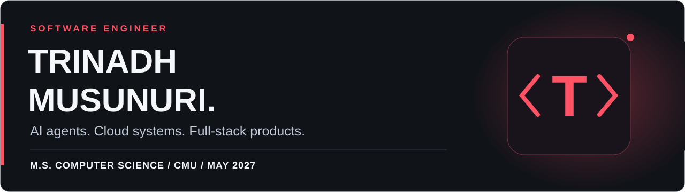
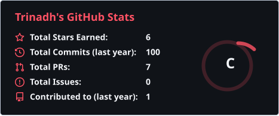
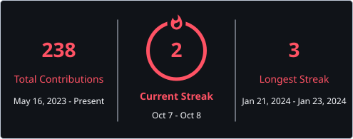
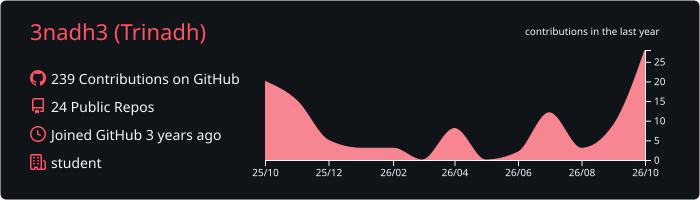
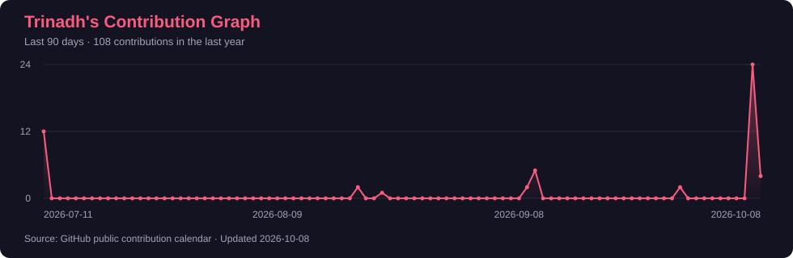

  

  

  
  
  
  

I build software across **AI, backend systems, and full-stack development**. My work connects production AI agents at **IBM**, adversarial ML and hardware research at **Central Michigan University**, and applications you can try below.

I’m completing my **M.S. in Computer Science at CMU**, with graduation expected in **May 2027**, and exploring software engineering opportunities in AI, cloud, systems, and full-stack development.

## Production impact

| AI agents | Observability | Deployment |
| :--- | :--- | :--- |
| **4 production agents** | **10–20 seconds** to investigate errors | **3 environments** |
| Slack, Teams, and phone integrations | Reduced from 10–15 minutes | Dev, Staging, and Production |

## Experience

### IBM · Software Engineer Intern, watsonx Orchestrate
**May–August 2026 · Austin, TX**

- Led Grafana dashboards using **Prometheus and Loki** for AI Gateway and Channel Integrations; deployed them through the SRE-managed repository across three environments.
- Built four omnichannel AI agents with **React, a custom MCP server, AWS, and watsonx Orchestrate**.
- Implemented a local voice runtime and CDR pipeline, and fixed voice traffic bypassing AI Gateway using structured STT/TTS logs across three speech providers.

### Central Michigan University · Research Assistant
**September 2025–May 2026 · Mount Pleasant, MI**

- Replaced evolutionary optimization with a gradient-based approach, reducing adversarial ML experiments from **30–60 minutes to under 3 minutes**.
- Profiled **AMD Ryzen AI NPU** execution through cycle counting and DRAM contention metrics; designed CPU–NPU benchmarks for hardware security research.
- Built an interactive **YOLOv2 adversarial attack demo** on Hugging Face Spaces with a Cloudflare Worker proxy, used by students.

<strong>Earlier experience</strong>

**Tech-Mark Training India · AI & Data Science Intern** 
January–March 2025 · Remote

Completed a three-month internship applying ML algorithms, data preprocessing, and model evaluation.

## Selected projects

### CyberGuard XAI
**Explainable phishing detection** — inspect word-level risk signals, explore suggested substitutions, and see how changes affect predictions.

`React` `Vite` `FastAPI` `TF-IDF / Logistic Regression` `DistilBERT MLM` `LIME` `SHAP`

[Try the demo →](https://cyberguard-xai.netlify.app/) · [Explore the code](https://github.com/3nadh3/Cyber-Guard-XAI)

### SkillSwap
**Peer skill exchange and messaging** — match people through their skills, with a MERN application, JWT-secured APIs, and real-time messaging.

`MongoDB` `Express` `React` `Node.js` `WebSockets` `JWT`

[Try the demo →](https://skill-swap.netlify.app/) · [Frontend](https://github.com/3nadh3/Hackthon-frontend) · [Backend](https://github.com/3nadh3/Hackthon-backend)

### M-Sum-PAI
**Multimodal transcription and summarization** — turn text, audio, video, and PDFs into concise summaries and bullet points.

`React` `Node.js` `Express` `Gemini API` `AssemblyAI`

[Try the demo →](https://transcripto-ai.netlify.app/) · [Frontend](https://github.com/3nadh3/AI-Transcriber-Summarize-Frontend) · [Backend](https://github.com/3nadh3/ai-transcriber-summarizer-backend)

### Portfolio & Jambo
**A Netflix-inspired portfolio with a contextual AI assistant** — different profiles highlight experience, projects, and research; the chatbot receives recent conversation history and generates relevant follow-up questions.

`React` `TypeScript` `Vite` `Tailwind CSS` `Node.js` `Express` `Google AI API`

[Explore the portfolio →](https://trinadh.dev/) · [Portfolio code](https://github.com/3nadh3/portfolio) · [Chatbot code](https://github.com/3nadh3/portfolio-chatbot/tree/master)

<strong>More projects</strong>

- [StudentRequestHub](https://github.com/3nadh3/StudentRequestHub) — an e-permission application built with HTML, CSS, PHP, and MySQL.
- [Data Analysis Web App](https://github.com/3nadh3/Data-Analysis-Web-App) — interactive data visualization and analysis.

## Engineering toolkit

| Area | Technologies |
| :--- | :--- |
| **Languages** | Python, Java, JavaScript, C, SQL |
| **Web & APIs** | React, Node.js, Express, FastAPI, Vite, REST, WebSockets, JWT |
| **AI & agents** | watsonx Orchestrate, MCP, PyTorch, Vertex AI, Hugging Face, DistilBERT, YOLOv2, LIME, SHAP |
| **Observability & infrastructure** | Grafana, Prometheus, Loki, Redis, Docker, CI/CD |
| **Cloud** | AWS: EC2, S3, IAM, RDS, Lambda · Google Cloud · IBM Cloud · Netlify · Render |
| **Databases & tools** | MongoDB, MySQL, PostgreSQL, Git, GitHub, Postman, Bruno, OpenAPI |

## GitHub Stats

  
  

  

## Contribution Graph

  

Images refresh daily from GitHub and the original stats services. If a service is unavailable, the last successful image stays visible.

## Education & credentials

**M.S. Computer Science · Central Michigan University** 
Expected **May 2027** · College of Science and Engineering 
Advanced Algorithms · Cloud Computing · Web Technologies · Machine Learning

**B.Tech Information Technology · Sir C R Reddy College of Engineering** 
2021–2025

- [**NVIDIA — Fundamentals of Deep Learning**](https://learn.nvidia.com/certificates?id=h_6y4MSeQ_KLXWGKnuJkPA) · November 2025
- [**Google Cloud — Generative AI**](https://skills.google/public_profiles/7537c6b2-75aa-4f6d-9c96-be8f78859f0f) · November 2024
- [**AWS — Cloud Technical Essentials**](https://www.coursera.org/account/accomplishments/certificate/GGN5MXGHUQEM) · November 2023

---

**Have a role or project in mind?** [Email me](mailto:trinadh.musunuri@gmail.com) or [connect on LinkedIn](https://www.linkedin.com/in/trinadh-musunuri/).
