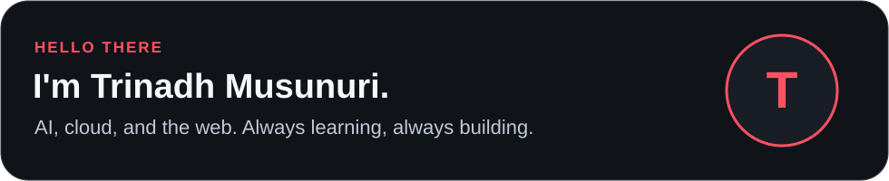

  

  M.S. Computer Science at <strong>Central Michigan University</strong> · May 2027 
  Learning new things and turning ideas into projects.

  
  
  

## My GitHub activity

  
  

  

More contribution stats

  

The graphs refresh daily. The last working image stays visible if a stats service is unavailable.

## A few things I've built

<table>
<tr>
<td width="50%">

<a href="https://cyberguard-xai.netlify.app/">Try it ↗</a> · <a href="https://github.com/3nadh3/Cyber-Guard-XAI">Code ↗</a>

</td>
<td width="50%">

<a href="https://skill-swap.netlify.app/">Try it ↗</a> · <a href="https://github.com/3nadh3/Hackthon-frontend">Frontend ↗</a> · <a href="https://github.com/3nadh3/Hackthon-backend">Backend ↗</a>

</td>
</tr>
<tr>
<td width="50%">

<a href="https://transcripto-ai.netlify.app/">Try it ↗</a> · <a href="https://github.com/3nadh3/AI-Transcriber-Summarize-Frontend">Frontend ↗</a> · <a href="https://github.com/3nadh3/ai-transcriber-summarizer-backend">Backend ↗</a>

</td>
<td width="50%">

<a href="https://trinadh.dev/">Take a look ↗</a> · <a href="https://github.com/3nadh3/portfolio">Code ↗</a> · <a href="https://github.com/3nadh3/portfolio-chatbot/tree/master">Chatbot ↗</a>

</td>
</tr>
</table>

More projects

- [StudentRequestHub](https://github.com/3nadh3/StudentRequestHub) — student permission requests.
- [Data Analysis Web App](https://github.com/3nadh3/Data-Analysis-Web-App) — exploring and visualizing data.

## What I work with

- **Code & web:** Python, Java, JavaScript, SQL, React, Node.js, FastAPI.
- **AI & cloud:** PyTorch, LLM APIs, MCP, AWS, Google Cloud, Docker.
- **Data & tools:** PostgreSQL, MongoDB, Git, Grafana, Prometheus.

A few credentials

- [NVIDIA — Fundamentals of Deep Learning](https://learn.nvidia.com/certificates?id=h_6y4MSeQ_KLXWGKnuJkPA)
- [Google Cloud — Generative AI](https://skills.google/public_profiles/7537c6b2-75aa-4f6d-9c96-be8f78859f0f)
- [AWS — Cloud Technical Essentials](https://www.coursera.org/account/accomplishments/certificate/GGN5MXGHUQEM)

---

Want to say hi? [Email me](mailto:trinadh.musunuri@gmail.com) or [connect on LinkedIn](https://www.linkedin.com/in/trinadh-musunuri/).
